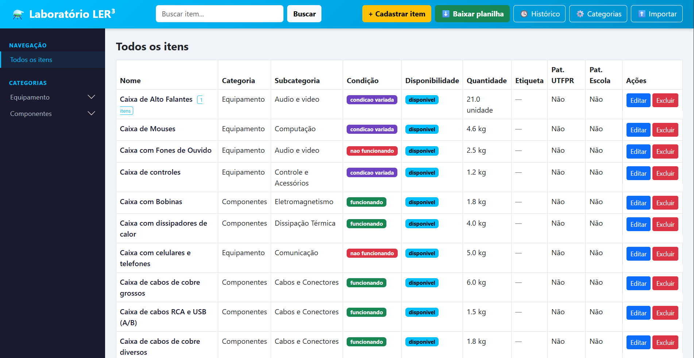
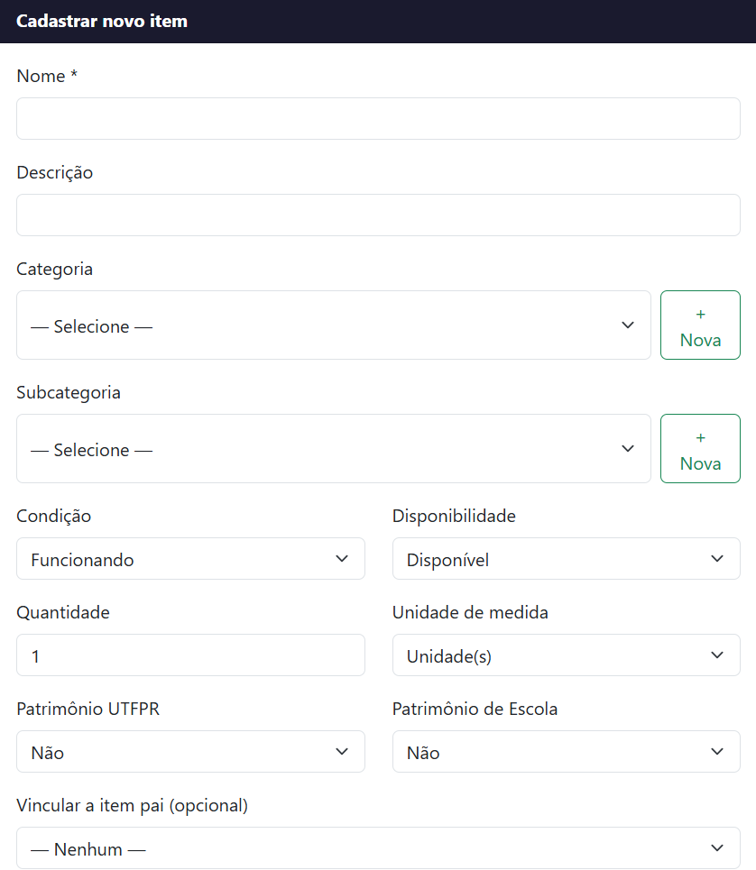
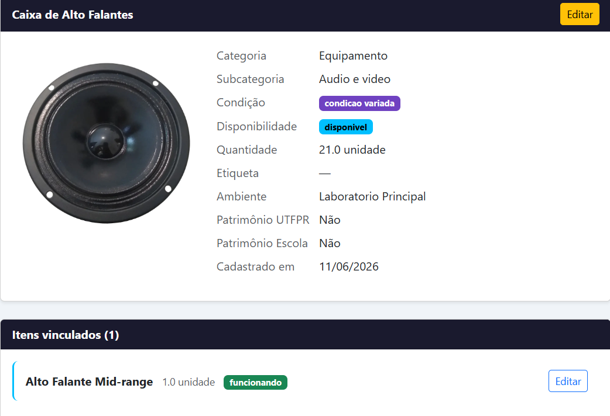
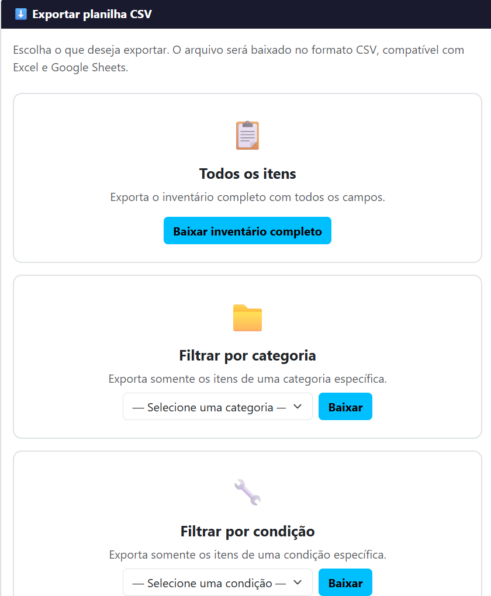

# Inventário LER³

Sistema web de inventário e gestão de equipamentos eletrônicos desenvolvido para o laboratório **LER³ (Laboratório de Eletrônica Reutilizável e Reciclagem)** da UTFPR — Campus Ponta Grossa.

Desenvolvido como projeto da disciplina de Computação — Engenharia Elétrica UTFPR.

---

## Interface

### Tela principal

### Cadastro de item

### Detalhe do item

### Exportação de dados

---

## Sobre o projeto

O LER³ recebe equipamentos eletrônicos descartados, realiza triagem e reaproveitamento em projetos educacionais. Este sistema foi desenvolvido para organizar e tornar acessível o acervo do laboratório, resolvendo o problema de materiais sem registro e difíceis de localizar.

---

## Funcionalidades

- Cadastro, edição e exclusão de itens
- Categorias e subcategorias gerenciáveis pela interface
- Cinco condições: Funcionando, Não funcionando, Em manutenção, Condição variada, Sem status
- Patrimônio UTFPR e Patrimônio de Escola
- Suporte a montantes (kg, metros, litros, unidades)
- Localização com código de etiqueta
- Upload de foto por item
- Cadastro hierárquico — itens vinculados a montantes
- Página de detalhe com subitens
- Navegação por categorias com filtro por subcategoria
- Busca por nome
- Histórico de exclusões com motivo e data
- Exportação CSV por inventário completo, categoria ou condição
- Importação de dados via CSV

---

## Tecnologias utilizadas

| Tecnologia | Função |
|---|---|
| Python 3 | Linguagem principal do backend |
| Flask | Framework web para rotas e servidor local |
| SQLAlchemy | ORM para comunicação com o banco de dados |
| SQLite | Banco de dados em arquivo único |
| Bootstrap 5 | Interface visual responsiva |
| Jinja2 | Motor de templates HTML |

---

## Como executar

1. Clone o repositório
2. Instale as dependências:
3. Execute o sistema:python app.py
4. Acesse no navegador: `http://127.0.0.1:5000`

## Estrutura do projeto
ler3/
├── app.py              # Ponto de entrada
├── models.py           # Modelos do banco de dados
├── routes.py           # Rotas da aplicação
├── requirements.txt    # Dependências
├── static/
│   └── imagens/        # Fotos dos itens
└── templates/
├── index.html
├── cadastrar.html
├── editar.html
├── detalhe.html
├── gerenciar.html
├── historico.html
├── exportar.html
└── importar.html

## Implementações futuras

- **Etiquetagem com QR Code** — geração de etiquetas físicas vinculadas ao inventário para localização rápida dos itens no laboratório
- **Acesso mobile e web** — tornar o sistema acessível via navegador no celular ou como aplicação instalável
- **Integração com Google Forms** — membros da UTFPR poderiam submeter pedidos de conserto via formulário, com aprovação ou recusa pelo responsável do LER³ e registro automático no inventário
- **Acesso em rede** — disponibilizar o sistema para múltiplos usuários simultâneos pela rede interna da universidade

## Projeto de extensão

Desenvolvido por Thiago — Engenharia Elétrica UTFPR
Projeto de extensão LER³ — Ponta Grossa, 2025
